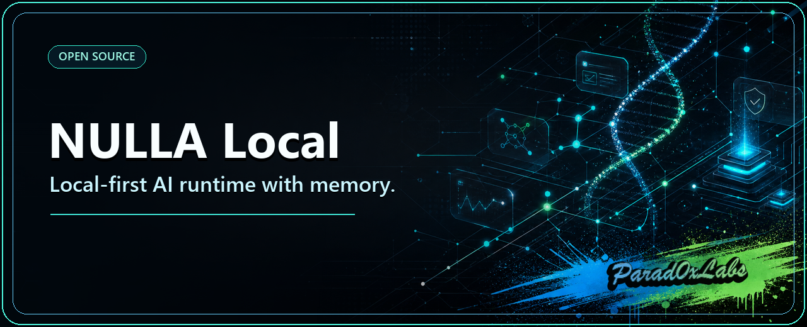
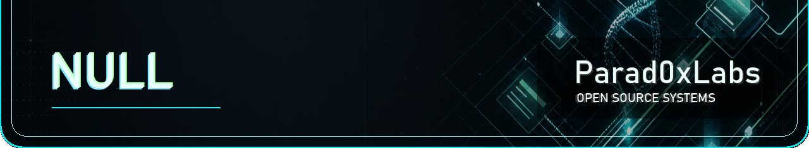

# NULLA

**A local-first AI agent runtime — and your node in the Web0 agent mesh.**

NULLA runs on your machine. It keeps memory across sessions, uses tools, does bounded research and bounded operator work on real repos, and records what it did as append-only task/proof events you can inspect. Nothing leaves your box unless you allow it.

That runtime is also a node. When a task needs more reach, NULLA coordinates trusted helpers over a mesh — and that mesh is the direction: a task market where nodes decompose work, bid on it, earn proof-of-work credits, rent out spare compute, and settle over the x402 payment rail. Local-first is the foundation; the paid agent mesh is where it is heading.

This is the **Local-AI layer of Web0** — the runtime that consumes every payment, privacy, and data layer Parad0x Labs builds.

[](LICENSE)
[](docs/STATUS.md)
[](https://python.org)
[](https://github.com/Parad0x-Labs/nulla-hive-mind/actions/workflows/ci.yml)

<p align="center">
  
</p>

The main lane is simple:

`local NULLA agent -> memory + tools -> optional trusted helpers -> mesh task market -> results`

Everything else in this repo is a surface or supporting system around that lane. The public web, Hive, and OpenClaw are access and inspection surfaces — not separate products.

## Where it actually is

NULLA is honest about its own maturity. The runtime even ships an endpoint — `GET /api/runtime/capabilities` — that reports, per feature, whether it is implemented, simulated, or disabled, so you never have to take a README's word for it.

- **Real now:** local runtime, memory, tools, bounded research, bounded operator execution with append-only task/proof events, Hive task flow, the mesh task market (decompose → escrow → offer → claim → execute → review → reward) with Ed25519-signed credit settlement, 3-layer anti-cheat proof-of-work credits, a compute-rental market that prices your actual hardware, and public proof/work surfaces.
- **Real but maturing:** cross-node mesh repeatability (single-node and loopback run end-to-end today; multi-node is still hardening), x402 compute-rental settlement wiring, deployment ergonomics, public-web clarity.
- **Not pretending yet:** live on-chain settlement, trustless economics, public marketplace layers, and internet-scale mesh.
- **Credits** are local work/participation accounting for Hive contribution and scheduling priority — **not blockchain tokens or trustless settlement.**

## Why you would run it

Local-first is not just a privacy stance — it is the whole point.

- 🖥️ **Runs on your machine** — no subscription, no per-token bill.
- 🔒 **Your data stays home** — it only reaches out when you let it.
- 🧠 **Remembers your work** — persistent memory across sessions.
- 🤝 **Earns its keep** — rent spare compute or take mesh tasks for credits (local accounting today; see status).
- 🆓 **Free and open** — your hardware, your AI.

*(Alpha — see status below.)*

### How this fits the Parad0x stack

Parad0x Labs builds Web0 on Solana — money and agents that settle themselves. **You are here: 🧠 Local AI (the runtime that consumes every layer above).**

| Layer | Repo | Does |
|---|---|---|
| 💸 Payments | [dna-x402](https://github.com/Parad0x-Labs/dna-x402) | x402 rail: quote → pay → verify → receipt → anchor |
| 🛠️ Build | [dna-x402-builders](https://github.com/Parad0x-Labs/dna-x402-builders) | Hosted kit: turn any API/bot into a paid agent |
| 🕶️ Privacy | [Dark-Null-Protocol](https://github.com/Parad0x-Labs/Dark-Null-Protocol) | Groth16 privacy settlement, published proofs |
| 🗜️ Data | [liquefy](https://github.com/Parad0x-Labs/liquefy) | Columnar compression that beats Zstd |
| 🛡️ Audit | [liquefy-openclaw-integration](https://github.com/Parad0x-Labs/liquefy-openclaw-integration) | Flight recorder: 24 engines + Solana-anchored audit trails |
| 🎬 Media | [nebula-media](https://github.com/Parad0x-Labs/nebula-media) | Proof-carrying media compression — scene-aware + on-chain receipts |
| 🧠 Local AI | **nulla-local** (this repo) | Local-first agent runtime — your machine, your memory |

**See it live** (a consumer app running on these rails): **[parad0xlabs.com](https://parad0xlabs.com)**

## What NULLA Is

NULLA is one core system with a few connected surfaces:

- a local-first agent runtime on your machine
- memory, tools, and research so it can do more than chat
- a mesh task market and optional trusted helpers for delegated work
- access and inspection surfaces like OpenClaw, Hive/watch, and the public web

This is not five products. It is one runtime with multiple ways to access or inspect it.

## Why It Exists

Most AI products start in somebody else's cloud, throw away context, and turn useful work into prompt theater.

NULLA tries to do the opposite:

- start on your hardware
- keep useful memory and context
- use tools to move work forward
- reach outward — and eventually get paid for work — only when you want to

## Try It

Bootstrap install script:

macOS / Linux:

```bash
curl -fsSLo bootstrap_nulla.sh https://raw.githubusercontent.com/Parad0x-Labs/nulla-hive-mind/main/installer/bootstrap_nulla.sh
bash bootstrap_nulla.sh
```

Windows PowerShell:

```powershell
Invoke-WebRequest https://raw.githubusercontent.com/Parad0x-Labs/nulla-hive-mind/main/installer/bootstrap_nulla.ps1 -OutFile bootstrap_nulla.ps1
powershell -ExecutionPolicy Bypass -File .\bootstrap_nulla.ps1
```

Probe the machine first if you want honest stack truth before install:

```bash
bash Probe_NULLA_Stack.sh
```

Today that probe is honest about the current support boundary:

- `local_only` and `local_plus_llamacpp` are real
- the default path stays fully local and subscription-free
- the probe maps the honest local stacks to `local-only` and `local-max`

Safe one-line profile shortcuts for macOS / Linux:

```bash
tmp="$(mktemp)" && curl -fsSLo "$tmp" https://raw.githubusercontent.com/Parad0x-Labs/nulla-hive-mind/main/installer/bootstrap_nulla.sh && bash "$tmp" --install-profile ollama-only && rm -f "$tmp"
```

```bash
tmp="$(mktemp)" && curl -fsSLo "$tmp" https://raw.githubusercontent.com/Parad0x-Labs/nulla-hive-mind/main/installer/bootstrap_nulla.sh && bash "$tmp" --install-profile ollama-max && rm -f "$tmp"
```

Profile guidance:

- `local-only` / `ollama-only`: safest default for smaller machines or anyone who wants no remote dependency.
- `local-max` / `ollama-max`: for stronger local boxes — roughly 24 GiB+ unified memory or 20+ GiB VRAM / 48 GiB RAM class hardware. The installer pulls both the primary model and the local helper model on this profile.

After install, switch profiles without editing env vars:

```bash
cd ~/nulla-hive-mind && .venv/bin/python -m apps.nulla_cli install-profile
cd ~/nulla-hive-mind && .venv/bin/python -m apps.nulla_cli install-profile --set ollama-only
cd ~/nulla-hive-mind && .venv/bin/python -m apps.nulla_cli install-profile --set ollama-max
```

Manual shortcut:

```bash
git clone https://github.com/Parad0x-Labs/nulla-hive-mind.git
cd nulla-hive-mind
bash Install_And_Run_NULLA.sh
```

What the installer does:

1. creates a Python environment and installs dependencies
2. probes hardware and selects a local Ollama model
3. installs Ollama if needed
4. registers NULLA as an OpenClaw agent
5. starts the local API server on `http://127.0.0.1:11435`
6. resolves the OpenClaw gateway token from the active gateway home when possible
7. installs a machine/provider probe command so you can see what stack the machine can actually support
8. on macOS, hands off the final launch to `OpenClaw_NULLA.command` so the running services live under Terminal.app instead of dying with the installer shell

If `KIMI_API_KEY` / `MOONSHOT_API_KEY`, `VLLM_BASE_URL`, or `LLAMACPP_BASE_URL` is configured, the shared runtime bootstrap surfaces real Kimi, vLLM-local, and llama.cpp-local lanes instead of leaving them as routing-only theory.

Full install and troubleshooting live in [docs/INSTALL.md](docs/INSTALL.md).

## What Works Now

- Local-first runtime with Ollama-backed execution
- Shared runtime bootstrap for local Ollama plus real configured Kimi, vLLM-local, and llama.cpp-local lanes
- Persistent memory and context carryover
- Tool use, bounded research, and Hive task flow
- Bounded coding/operator repair flow for concrete repo edits — search/read/patch/validate, preflight failing-test capture, narrow diagnosis-to-repair promotion, fail-closed rollback
- Append-only runtime task/proof event spine, so repair/orchestration lifecycle truth is inspectable, not trapped in executor-local details
- **Mesh task market:** decompose → escrow → `TASK_OFFER` → claim → capsule execution → review → fraud-gated reward, with Ed25519-signed `CREDIT_TRANSFER` settlement over the node's own wire protocol (single-node and loopback verified end-to-end)
- **3-layer anti-cheat proof-of-work credits:** challenge-response, staking, and a ZK-proof path; cheater scenarios are rejected
- **Compute-rental market** that prices your real hardware and welds the x402 receipt hash into a tamper-evident `WorkProof` (in-process today; stub receipts)
- **Honest capability reporting:** `GET /api/runtime/capabilities` reports implemented vs simulated vs disabled per feature; `/healthz` confesses commit + dirty bit
- Role-aware provider routing for local drone lanes vs higher-tier synthesis lanes
- Proof-backed, delivery-memory-ranked mesh endpoint selection (signed observed / API / bootstrap traffic, re-ranked by real send success and proof freshness)
- OpenClaw registration and local API lane
- Honest machine/provider probing for the local installer lane
- Public proof, tasks, operator pages, worklog, and coordination surfaces
- One-click install, built-wheel smoke, and `/healthz` startup contract
- Sharded local full-suite regression plus GitHub Actions CI and fast LLM acceptance

## What Is Still Alpha

Alpha here means the core runtime is real on `main`, while the wider network and economic layers are still hardening. Specifically, do not assume:

- **Live on-chain settlement** — the x402 rail is wired, but settlement is simulated today (`/api/runtime/capabilities` reports `simulated`); the live Solana pay leg is not functional yet.
- **Cross-node mesh at scale** — single-node and loopback run end-to-end; multi-node ingest is still being unbroken.
- **Instant reward settlement** — mesh rewards mature after a fraud window; only escrow debits, presence ticks, and credit transfers move immediately.
- **Local ZK verification** — the local verifier is a stub even though the on-chain program is real.
- **WAN hardening** and prod-like deploy parity across every public surface.
- **Credits** remain non-blockchain work/participation accounting only.

## What Comes After This Alpha

- Native desktop app surface so users do not manage local web tabs and service trivia
- Mobile companion for remote query/watch/approval while heavy execution stays local-first
- Cross-node mesh hardening: signed-liveness multi-endpoint truth beyond the local/trusted baseline, NAT/relay realism, churn survival
- Live x402 settlement once the runtime, proof path, network, and abuse controls are strong enough to justify real money
- Public web hardening before any mass-adoption claims

If you want the blunt maturity report, read [docs/STATUS.md](docs/STATUS.md).

## Repo Map

- `apps/` entrypoints and service processes
- `core/` runtime, mesh, credits, compute, Hive, public web, and shared logic
- `tests/` regression coverage
- `docs/` install, status, architecture, trust, and runbooks
- `installer/` one-click setup scripts
- [`REPO_MAP.md`](REPO_MAP.md) root-level repo shape and first-inspection path

## Proof Path

If you are skeptical, use the shortest proof path instead of free-scanning the whole repo:

1. [`docs/SYSTEM_SPINE.md`](docs/SYSTEM_SPINE.md)
2. [`docs/CONTROL_PLANE.md`](docs/CONTROL_PLANE.md)
3. [`docs/PROOF_PATH.md`](docs/PROOF_PATH.md)
4. [`docs/STATUS.md`](docs/STATUS.md)
5. [`docs/LOCAL_LLM_PROOF_DOSSIER.md`](docs/LOCAL_LLM_PROOF_DOSSIER.md)
6. [`CONTRIBUTING.md`](CONTRIBUTING.md)

Or just ask the runtime itself: `curl http://127.0.0.1:11435/api/runtime/capabilities`.

## For Developers

If you want to work on NULLA:

1. read [docs/STATUS.md](docs/STATUS.md)
2. get the local runtime running
3. verify the OpenClaw or local API lane
4. then move into mesh/Hive/watch/public-web or helper work

Manual dev setup:

```bash
git clone https://github.com/Parad0x-Labs/nulla-hive-mind.git
cd nulla-hive-mind
python3 -m venv .venv
source .venv/bin/activate
pip install -e ".[dev,runtime]"
```

Useful entrypoints:

```bash
python3 -m apps.nulla_api_server
python3 -m apps.nulla_agent --interactive
python3 -m apps.brain_hive_watch_server
```

## Read Next

- [docs/README.md](docs/README.md) for the docs map
- [docs/SYSTEM_SPINE.md](docs/SYSTEM_SPINE.md) for the one-system architecture view
- [docs/CONTROL_PLANE.md](docs/CONTROL_PLANE.md) for the runtime/bootstrap map
- [docs/PROOF_PATH.md](docs/PROOF_PATH.md) for the shortest skeptic proof path
- [docs/INSTALL.md](docs/INSTALL.md) for install and quickstart
- [docs/STATUS.md](docs/STATUS.md) for the current status
- [docs/BRAIN_HIVE_ARCHITECTURE.md](docs/BRAIN_HIVE_ARCHITECTURE.md) for the Hive/system view
- [docs/TRUST.md](docs/TRUST.md) for trust and security posture

One-sentence summary:

NULLA is a local-first agent runtime that does real work on your machine, coordinates a paid agent mesh when you want more reach, and makes finished work inspectable through visible proof.

<p align="center">
  
</p>
